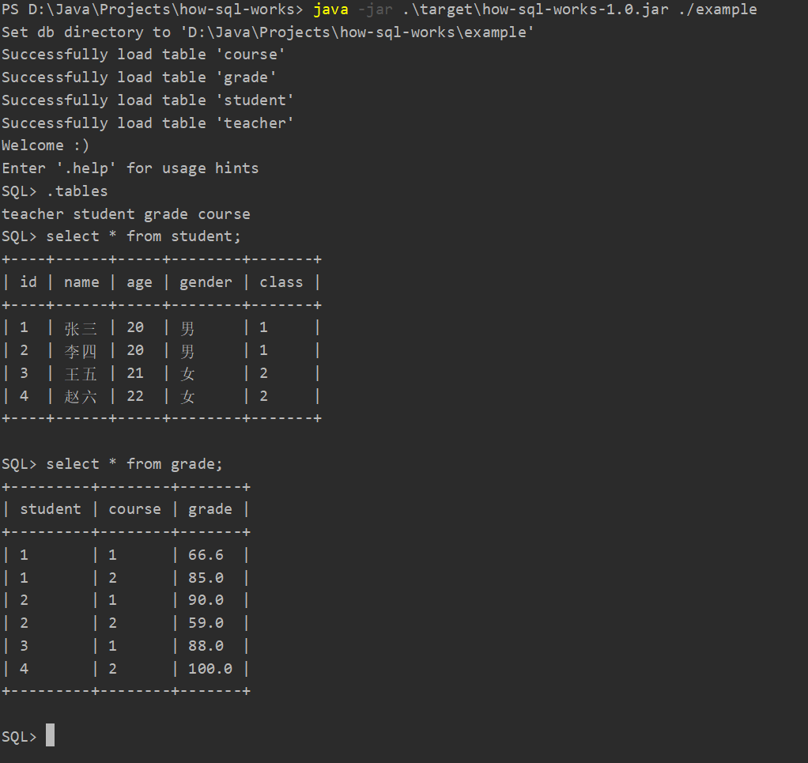
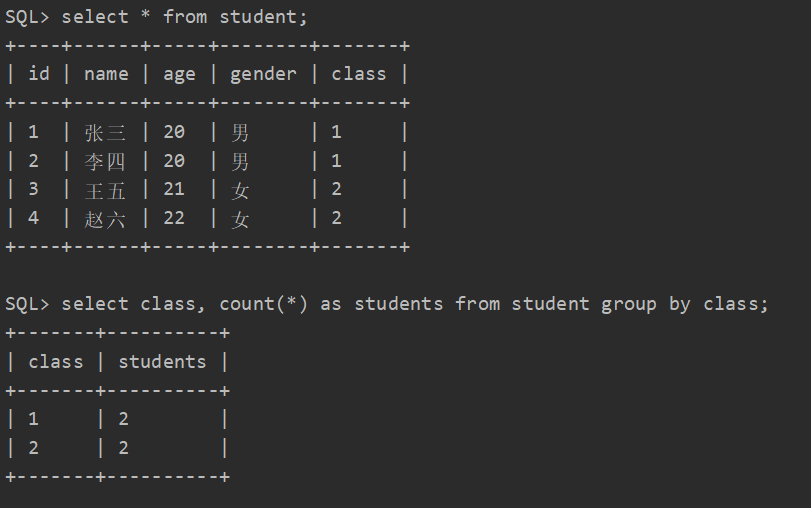
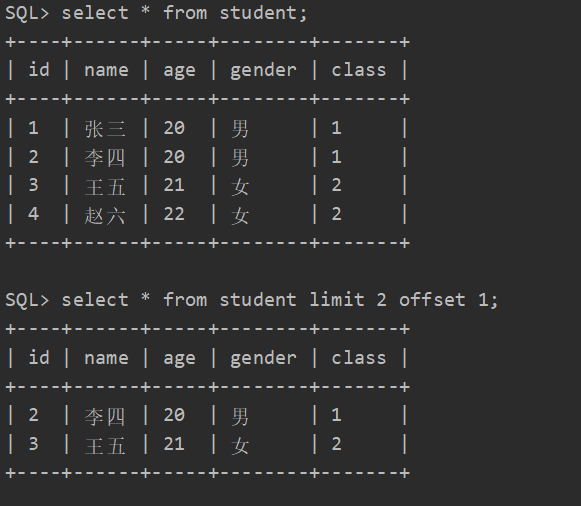
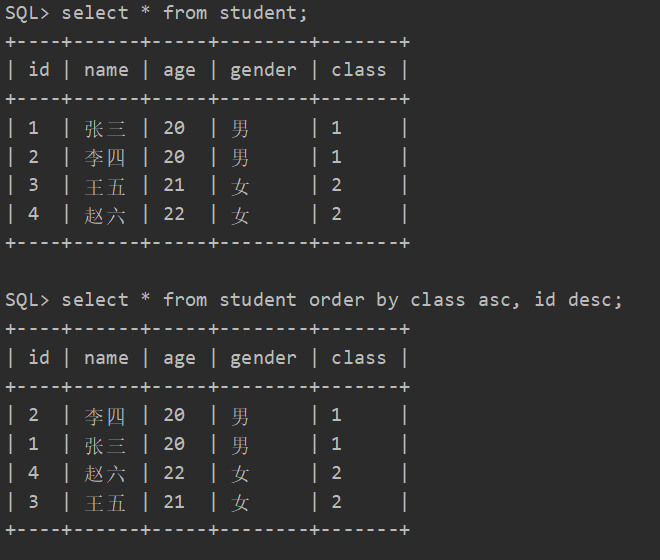
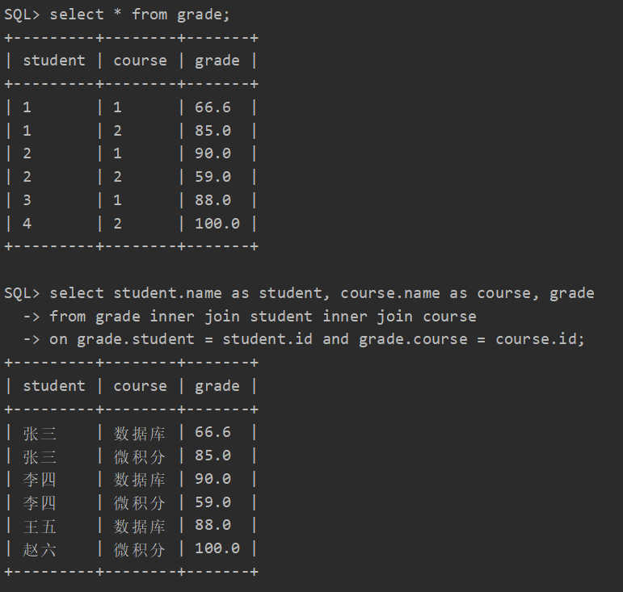
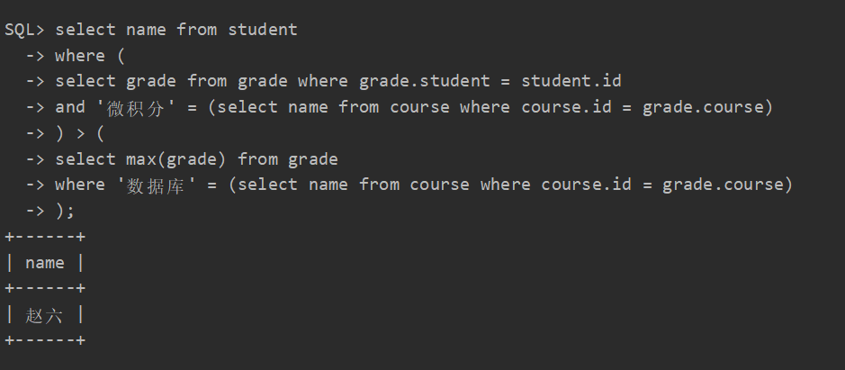

# how-sql-works

SQL 的解析与执行，基于简易 CSV 数据库。

支持表的 create, delete, drop, insert, select, update 语句，select 语句支持子查询和内、左连接（右连接和外连接可通过左连接实现，索性就不直接支持了）。

没有提供对数据库的 CRUD 语句，一个目录就是一个数据库，一个 csv 文件就是一张表。

不支持事务、并发、视图、完整性约束等。

提供 SQLite 风格的元命令（meta command）。

```
how-sql-works> mvn package
how-sql-works> java -jar target/how-sql-works-1.0.jar
Welcome :)
Enter '.help' for usage hints
Connected to a transient in-memory database
Use '.db <db directory>' to work on a persistent database
SQL> .help
.db <db directory>       Change database directory
.debug <on | off>        Change debug mode, ast will be echoed if set to on
.exit                    Exit this program
.help                    Show this message
.mode <column | json>    Set output mode of select statements
.quit                    Exit this program
.schema <table name>     Show the description of a table
.source <filename>       Execute SQL statements from a file
.tables                  Show all tables
SQL> .quit
Bye :)
```

## 架构


## 示例

./example 下面有如下 csv 文件：

```
// student.csv
"id","name","age","gender","class"
"INT","STRING","INT","STRING","INT"
1,"张三",20,"男",1
2,"李四",20,"男",1
3,"王五",21,"女",2
4,"赵六",22,"女",2

// teacher.csv
"id","name","department"
"INT","STRING","STRING"
1,"王德法","计算机学院"
2,"张伟","数学学院"

// course.csv
"id","name","teacher"
"INT","STRING","INT"
1,"数据库",1
2,"微积分",2

// grade.csv
"student","course","grade"
"INT","INT","DOUBLE"
1,1,66.6
1,2,85.0
2,1,90.0
2,2,59.0
3,1,88.0
4,2,100.0

```

可以在启动系统时指定数据库目录将这些数据加载到系统中，如下图所示：



分组：



分页:



排序：



查询每个学生所有课程的成绩，按“学生姓名 课程设计 成绩”形式展示：



查询微积分成绩比所有人的数据库成绩都高的学生的姓名：



## 说明

[SQL.g4](./SQL.g4) 是对项目支持的 SQL 语法的描述，[Parser](./src/main/java/com/github/afkbrb/sql/Parser.java) 就是根据该语法写的。